A lot of programming languages provide a `contains` / `any` method that is used to check whether there is at least one element in a sequence that satisfies a given predicate. For example:

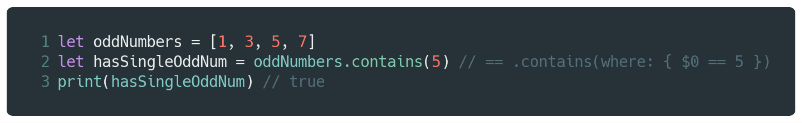

Now, suppose you wanted to check whether *every* element of a sequence satisfies a given predicate. That's pretty easy — you can invert both the condition and the result to achieve that. For example:

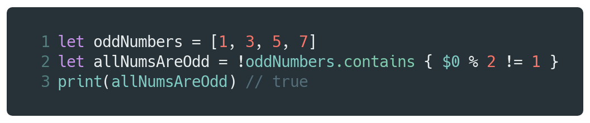

Functional programmers might prefer to use `reduce` instead:

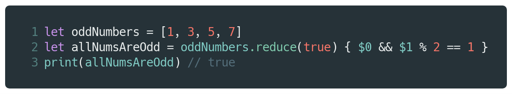

However, both approaches are actually less readable and the `reduce` approach introduces a hidden performance pitfall i.e. no short-circuiting. To address these problems, Swift 4.2 introduced a new [method](https://github.com/apple/swift/blob/master/stdlib/public/core/SequenceAlgorithms.swift#L540) in the standard library, called `allSatisfy`:

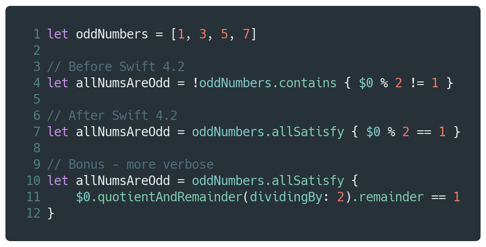

Now, imagine that our sequence of odd numbers was empty:

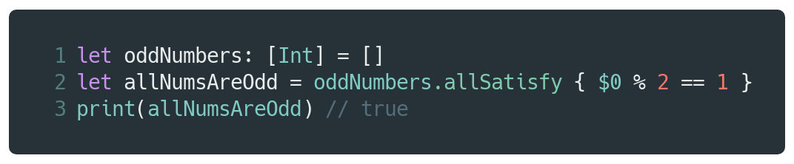

Wait… what?? There are clearly no numbers in `oddNumbers`, so there's nothing to satisfy the predicate. So, the result of `allSatisfy` should be `false` instead, right? Well… no. To understand why, we need to take a look at some math and logic.

## Quantification

A *quantifier* is basically something that transforms a statement asserting that a given thing has a certain property into a statement asserting the number (quantity) of things having that property.

For example, "all cars have wheels" or "the square of any natural number is non-negative". Here, "all" and "any" are the quantifiers.

In math, quantifiers are used in a similar way, but instead of operating on statements, it operates on mathematical functions. Its purpose is to allow us to specify the number of elements in the universe of discourse[^1] that satisfy a mathematical function with at least one free variable.

Here's a simple example:

0² = 0, 1² = 1 ∧ 2² = 4 ∧ 3² = 9 …, etc.

Here, we have a logical conjunction of propositions to argue that the square of any natural number is greater than or equal to zero[^2]. However, "…etc" cannot be interpreted as a logical conjunction, at least in formal logic, as it is not a valid logical constant.

Now, it's also not practical to write all the propositions because the set of natural numbers has infinite cardinality. So, how do we get around the limitations? Well, one way is by rewriting the statement using a quantifier:

for all natural numbers x, x² ≥ 0.

There's two immediate benefits of doing this:

1. We now have a *single* statement, instead of a statement composed of *infinitely many* propositions.
2. It is more accurate than the previous one, because we have now *explicitly* stated the domain (ℕ) and its nature (enumerability), rather than *assuming* it based on the presence of "…, etc".

This is an example of what's known as "universal quantification" (*for all*). It is one of two commonly used quantifiers used in math (the other being "existential quantification" i.e *there exists*).

Using symbolic notation (we use ∀ to say "for all"), we can write:

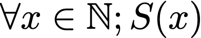

(where *S(x)* is a predicate that takes a natural number and returns whether its square is greater than or equal to zero or not)

## Sets

A set is simply a well-defined collection of elements[^3]. It exhibits certain properties, such as membership or cardinality. For example — 1, 2 & 3 are distinct elements, however {1, 2, 3} is a single set with three distinct elements. Similarly, | {1, 2, 3} | is 3 since there are three elements in the set.

Sets can also exhibit certain relationships between themselves. For example, a set can include elements of another set. This is a relationship which we refer to as being a "subset" of the other set. So, if we have two sets, A and B, then we can say that A is a subset of B if every element belonging to A is also in B. For example, if A = {1, 2, 3} and B = {1, 2, 3, 4} then A ⊆ B since 1, 2 & 3 all belong to B.

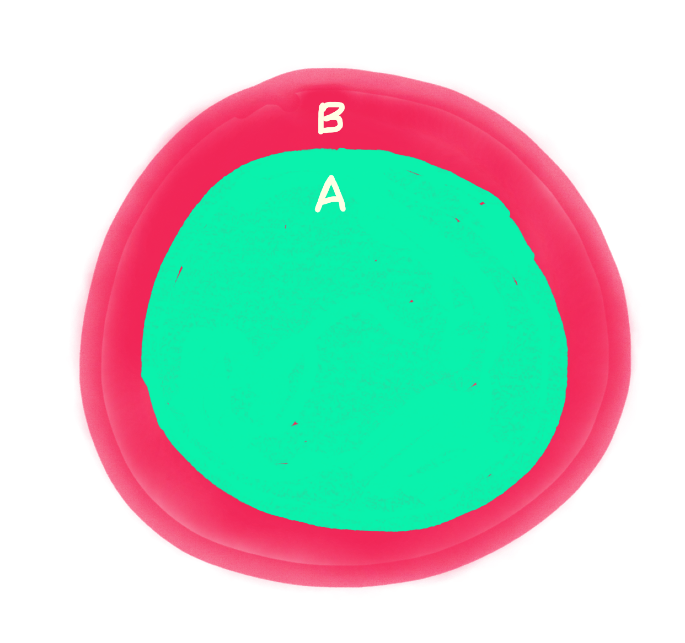

Using what we learned about quantifiers above, we can write the subset relation using symbolic notation as:

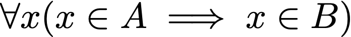

which is an *implication* in the form of "if…then", made up of two propositions *x* ∈ A and *x* ∈ B.

So, for all *x*, **if** it is true that *x* ∈ A, **then** it must be true that *x* ∈ B, since B includes A. However, if *x* ∉ A, it does not mean that **then** *x* ∉ B, because if A ⊆ B, then B could certainly contain elements that are not in A. There is no causal connection between the truth values of the propositions i.e. it is not a *logical* implication, but rather a *material* implication.

Here's another example: suppose A = ∅. Is A ⊆ B? Well, we can use propositional calculus to derive the answer. Let's use P as the antecedent (x ∈ A) and Q as the consequent (x ∈ B) of the implication P ⇒ Q (x ∈ A ⇒ x ∈ B):

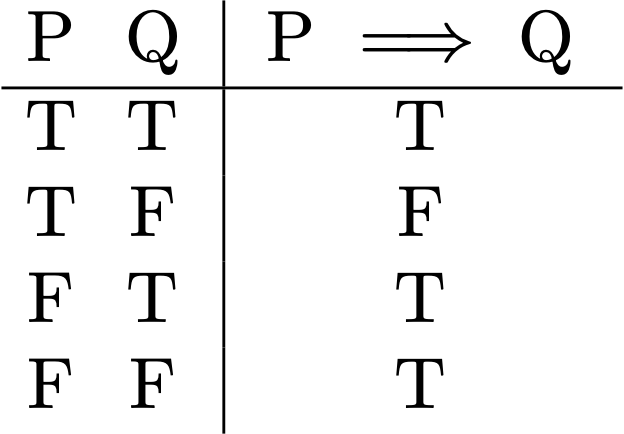

1. Since ∅ by definition has no elements, x ∈ A(∅) is *false*.
2. x ∈ B is *false* (due to above).

Using the truth table, we can say that the implication is *true* and the claim A ⊆ B holds. Remember, the truth value for the consequent (x ∈ B) is *irrelevant* when the antecedent (x ∈ A) is *false*, because the implication is *vacuously true*. This is also known as the principle of explosion i.e. false propositions imply anything.

Now, if you still find that strange, here's a different way to think about it — imagine I have an empty bag and I say "all the items in this bag are blue in colour". The only way to prove that the statement is *not* true is to find an item in the bag that is *not* blue. However, since there is nothing in the bag, the statement is true (otherwise you would have a contradiction).

Now, you must be wondering what the hell does quantifications and sets have to do with `allSatisfy` returning true for empty sequences? Well, if it's not already obvious by now, `allSatisfy` is basically just universal quantification:

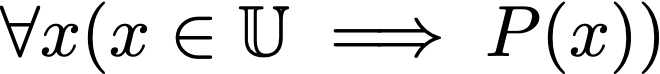

(where *P(x)* is a predicate that takes an element of the universe and returns whether it satisfies the predicate).

If we do universal quantification over the empty set:

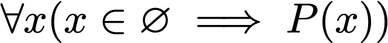

then it is *vacuously true*, regardless of the truth value of the predicate *P(x)*.

This is why `allSatisfy` returns true for empty sequences and it is (unfortunately) *not* a mistake. For people who are not used to the mathematical way of thinking, this might be a little confusing since the language of formal logic/math is a little different than the English language.

However, it might help if you think of the sequence as a set and the predicate as a function that checks whether the element belongs to some other set.

For example:

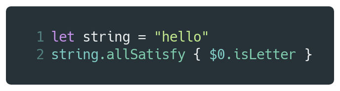

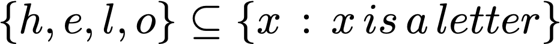

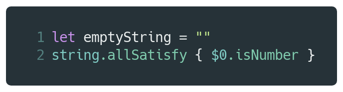

[^1]: This is also commonly referred to as a "universal set", however whether such a set exists or not is completely dependent on the particular set theory being used.

[^2]: There is no universal agreement on whether ℕ includes zero, however the ISO specification does include zero.

[^3]: There is no formal definition for a "set". It's like asking "what's the definition of a definition?". Naively, you can say that a set is just a collection of things, but mathematically speaking, a set is merely any object that satisfies the axioms of a particular set theory and so we cannot assign a single definition to it.