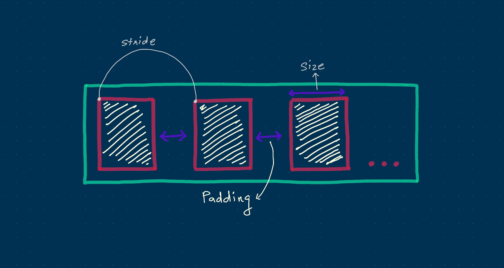
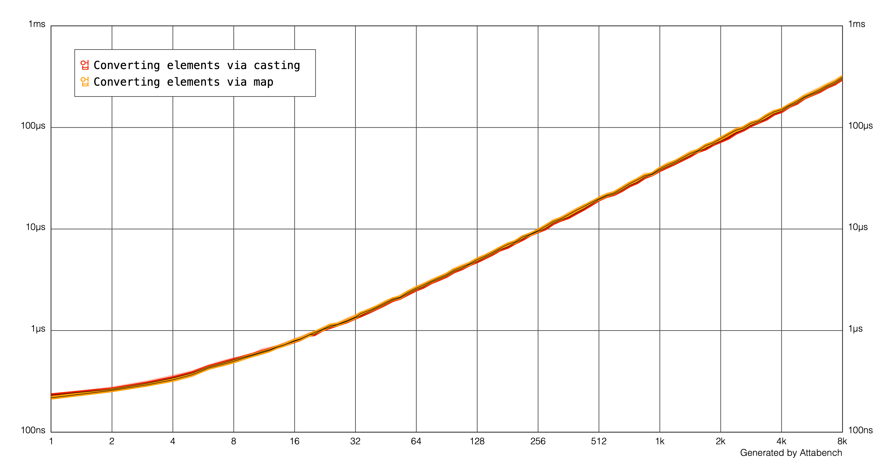

Type casting is a really easy and convenient way to check the type of an instance or to convert its type to another type.

One of the operations we sometimes perform when dealing with collections is to convert it into a collection of something else. We accomplish this by using the `map` function.

For example:

```swift
struct User {
  let name: String
}

struct Person {
  let name: String
}

let userArray = [User(name: "Suyash"), User(name: "Ben")]
let personArray = userArray.map { Person(name: $0.name) }
```

However, sometimes there is a relationship between the types and therefore we can skip the `map` and use a cast (`as` / `as?` / `as!`) instead.

For example:

```swift
protocol Boxable {}

struct IntBox: Boxable {
  let value: Int
}

let boxableIntArray = [IntBox(value: 9), IntBox(value: 8), IntBox(value: 7)]
let boxableArray = boxableIntArray as [Boxable]
```

Many people think of casting as a compile-time operation or something that happens within the type system and therefore has zero cost. However, that is **not true**, at least when it comes to casting collections.

To understand why, let's use the above example and go deeper.



The size of an array's buffer is *at least* `MemoryLayout<T>.stride * N` where `T` is the type of the element stored in the array and `N` is the number of elements stored in the array.

(and if you're wondering why `stride` is used, instead of `size`, here's a hint: alignment)

In our earlier example, we initially had an array of `IntBox` with three elements in it. Thus, the size of the buffer was 24 bytes.

```swift
protocol Boxable {}

struct IntBox: Boxable {
  let value: Int
}

print(MemoryLayout<IntBox>.stride * 3) // 24 bytes
```

But, when we upcasted it to an array of `Boxable`, something different happened. Yes, we went from an array of `IntBox` to an array of `Boxable`. But also, we went through a change in memory representation.

```swift
protocol Boxable {}

struct IntBox: Boxable {
  let value: Int
}

print(MemoryLayout<Boxable>.stride * 3) // 120 bytes
```

The size of the existing buffer was 24 bytes, however we can't fit three `Boxable` existential containers in it, because it needs a buffer that is 5 times larger.

This means we can't just simply copy the buffer and convert each element from one type to another. So, how are we able to cast an `[IntBox]` to a `[Boxable]`?

Well, by creating a brand new array of course! Yes, what's really going on is the runtime is effectively creating a brand new array and "mapping" each element from one type to the other. So, whenever you're casting a collection, what you're really doing (or rather, what the runtime is doing) is effectively a `map`. Yes, **very subtle**.

It's even *more* subtle when the explicit casting is not required:

```swift
protocol Boxable {}

struct IntBox: Boxable {
  let value: Int
}

let boxableIntArray = [IntBox(value: 9), IntBox(value: 8), IntBox(value: 7)]

func takesBoxable(_ array: [Boxable]) { ... }

takesBoxable(boxableIntArray) // what we're doing
takesBoxable(boxableIntArray.map({ $0 as Boxable})) // what's actually happening
```

Here's a very simple benchmark that demonstrates the cost of casting a collection (using the same code as the example):



As you can see, a cast has pretty much the same performance impact as a map.

Now, you might be wondering, what if the size of the existing buffer is much larger? Well, **it doesn't matter**. Whether you're upcasting or downcasting (regardless of the size of the existing buffer), either of those operations would result in a runtime call to either forcefully or conditionally perform the cast and you will have to pay the price, because both operations effectively [result](https://github.com/apple/swift/blob/master/stdlib/public/core/ArrayCast.swift) in a map.

Okay, so **why is this important to know**? Well, most people don't actually realise that casting a collection can change the performance characteristics of the code. There is an expectation that this kind of covariance would JustWork™ (without any gotchas), however that's not really the case because it's not a free conversion.

Unfortunately, there's nothing we can do about it. However, when performing casting like this, it might be better to be explicit and use a `map` instead (or leave a comment about this implicit behaviour). This can be helpful when you're working with performance sensitive code or collections with large number of elements (or both), so you can make the performance characteristics of your code more obvious to the person reading it.

---

**In summary, casting a collection is just a simpler way of calling `map`. It's not free, because it's a linear operation.**

If you want to learn how to write efficient Swift code that works with collections, I highly recommend buying the "Optimizing Collections" [book](https://gumroad.com/l/optimizing-collections), written by Károly Lőrentey, who works on the Swift Standard Library team.
