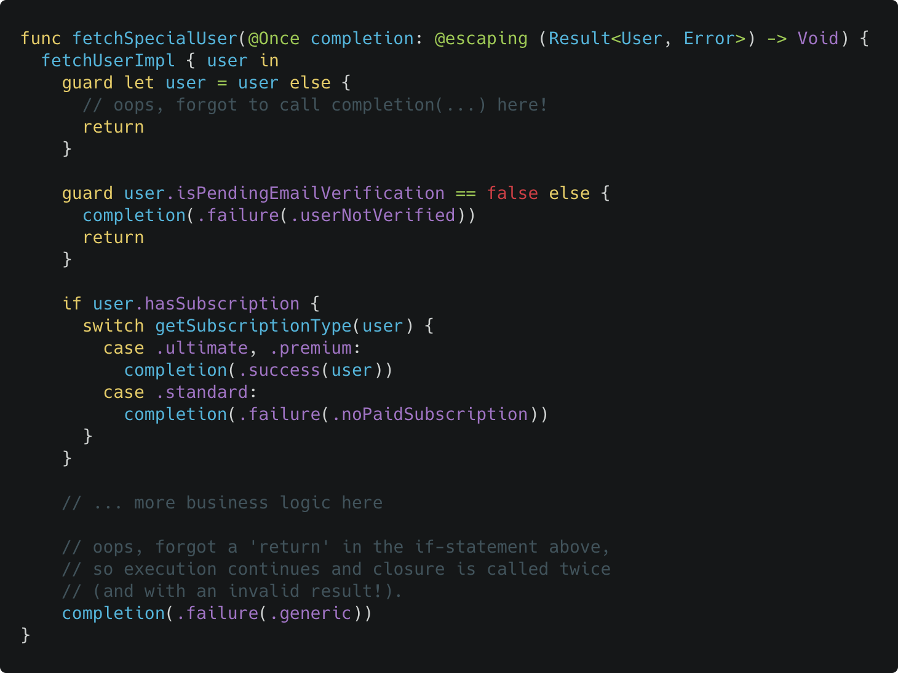
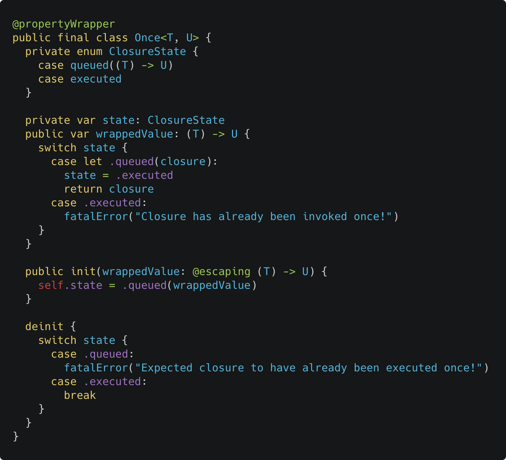
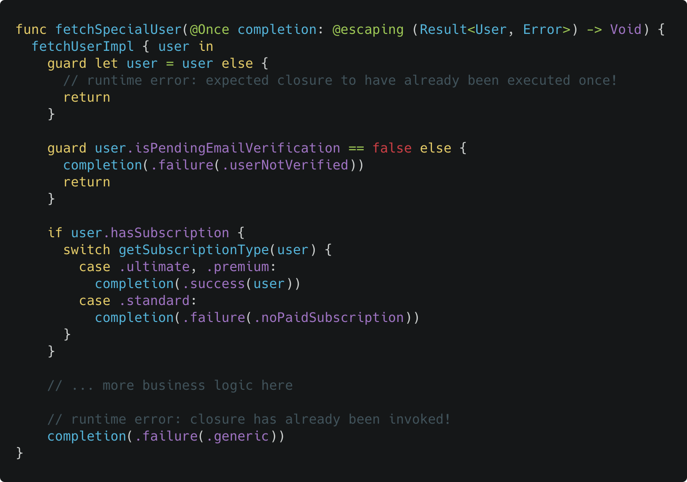

In Swift 5.5, property wrappers can now be placed on [function and closure parameters](https://github.com/apple/swift-evolution/blob/main/proposals/0293-extend-property-wrappers-to-function-and-closure-parameters.md). This has allowed me to write something that I and many people have always wanted in Swift — a way to somehow enforce that a closure is called exactly once.

To understand why, here's a simple example:

It's very common to write code where you have a function with a completion handler which must be called with a success or failure value based on the underlying result of the work that the function does.

But if you're not careful, it can be easy to make mistakes where you don't call the completion handler at all or call it more than once, especially if there's complicated business logic or error handling.

I admit I have made this mistake many times and sometimes it can be a little tricky or time-consuming to figure out exactly why your code isn't working as expected. After a bit of debugging and looking at the code, you realise "Oh! I forgot to call the completion handler!" or "Oh! I forgot to put a return statement!" and you go and fix your code. All good!

Though, wouldn't it be nice if your code can just shout at you "Hey! You forgot to call this closure!"? That's where the `@Once` property wrapper comes in handy.

Here's a naive implementation:

You can annotate your function parameter with this property wrapper:

And now you will get an error on runtime if the closure was not called exactly once in the body! ✨

> Don't forget that you can still use this property wrapper outside of function or closure parameters as well i.e. on local or instance properties which have a closure type, just like you already do on older versions of Swift!

One limitation of this property wrapper is that it does not work with non-escaping closures, since the closure needs to be stored inside the property wrapper for later execution. There is no way to prove to the compiler that the closure won't escape even if you know for a fact it won't (perhaps because your code is fully synchronous). So you will need to annotate your non-escaping closures with `@escaping` in order to use this, which is unnecessary in practice but unfortunately the only workaround.

You can find the full code on [GitHub](https://github.com/theblixguy/Once) which supports both throwing and non-throwing function types. The code is available as a Swift package that you can easily drop into your codebase if needed.